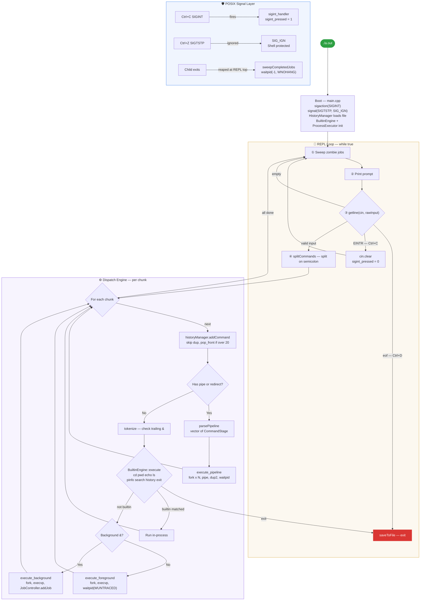

# SHELL — A POSIX Compliant Interactive Shell


```
   ____  _   _ _____ _     _
  / ___|| | | | ____| |   | |
  \___ \| |_| |  _| | |   | |
   ___) |  _  | |___| |___| |___
  |____/|_| |_|_____|_____|_____|

  Core Features:  Multi-Pipelines | Async Signals | Persistent History
  Architecture:   POSIX Compliant Shell v1.0
```

> A modular, robust command-line interpreter built from scratch in **C++**, implementing core OS concepts: **process spawning**, **asynchronous signal handling**, **N-stage IPC pipelines**, **file I/O redirection**, and **cross-session history persistence** — all via raw POSIX system calls.

---

## 📌 Table of Contents

1. [Introduction](#-introduction)
2. [How to Compile & Run](#-how-to-compile--run)
3. [Implemented Features](#️-implemented-features)
4. [System Architecture](#️-system-architecture--lifecycle)
5. [The Readline Trade-off](#️-the-readline-trade-off-canonical-io-vs-raw-tty)
6. [Project Structure](#-project-structure)
7. [Testing Examples](#-testing-examples)

---

## 🧠 Introduction

This project is a custom interactive Unix shell written entirely in **C++11**, built as part of an Advanced Operating Systems course assignment. It does not wrap `bash` or `sh` — every feature is implemented from scratch using raw POSIX system calls.

The shell directly interfaces with the Linux/macOS kernel via:
- `fork()` / `execvp()` — process creation and program loading
- `pipe()` / `dup2()` — inter-process communication and stream redirection
- `waitpid()` / `WNOHANG` — process lifecycle and zombie reaping
- `sigaction()` — hardware-safe signal handling
- `/proc` filesystem — live process inspection

The design philosophy prioritises **runtime stability** and **deterministic signal handling** over cosmetic terminal features.

---

## ⚡ How to Compile & Run

### Option 1 — Standard Compilation (No external dependencies)

```bash
g++ -std=c++11 *.cpp Commands/*.cpp -o a.out
./a.out
```

### Option 2 — With Warnings (Recommended)

```bash
g++ -Wall -Wextra -O2 -std=c++11 *.cpp Commands/*.cpp -o a.out
./a.out
```

Once launched, you will see the welcome banner and an interactive prompt:

```
<username@hostname:~/your/path> :
```

Type `exit` or press **Ctrl+D** to quit. History is automatically saved to `~/.historyState.txt`.

---

## 🛠️ Implemented Features

| # | Feature | Implementation Details | Status |
|---|---------|----------------------|--------|
| 01 | **Dynamic Prompt** | Formatted as `<user@host:path> :`. Resolves hostname via `gethostname()`, user via `getlogin()` / `getpwuid()`. Contracts home directory path to `~`. | ✅ |
| 02 | **Built-in: `cd`** | Supports `.`, `..`, `-` (previous dir), `~`, `~/path`. Stores `prevDir` for `-` navigation. Enforces single-argument validation. | ✅ |
| 03 | **Built-in: `pwd`** | Prints absolute CWD via `getcwd()`. | ✅ |
| 04 | **Built-in: `echo`** | Prints arguments to stdout with space separation and newline. | ✅ |
| 05 | **Built-in: `ls`** | Native implementation supporting `-a` (hidden files), `-l` (long format), combined flags (`-la`, `-al`), and multiple directory targets. | ✅ |
| 06 | **Built-in: `pinfo`** | Reads `/proc/<pid>/status`, `/proc/<pid>/stat`, and `/proc/<pid>/exe` to report process state (R/S/Z), virtual memory, and executable path. | ✅ |
| 07 | **Built-in: `search`** | Recursive depth-first filesystem traversal to find files/directories by name. Returns found/not-found. | ✅ |
| 08 | **Built-in: `history`** | `history` shows last 10 commands. `history N` shows last N (max 20). Reads from in-memory `std::deque` ledger. | ✅ |
| 09 | **Foreground Processes** | `fork()` + `execvp()`. Parent blocks via `waitpid(pid, WUNTRACED)`. Child restores default signal handlers before exec. | ✅ |
| 10 | **Background Processes** | Trailing `&` spawns child via `fork()` + `execvp()`. Parent immediately returns control. Job is registered in `JobController`. | ✅ |
| 11 | **Zombie Reaping** | `JobController::sweepCompletedJobs()` calls `waitpid(-1, WNOHANG)` at the top of every REPL iteration. Prints `[N] done <cmd>` on completion. | ✅ |
| 12 | **I/O Redirection** | `<` (stdin), `>` (stdout truncate), `>>` (stdout append). Implemented via `open()` + `dup2()` in child processes. Files created with `0644` permissions. | ✅ |
| 13 | **N-Stage Pipelines** | `cmd1 \| cmd2 \| ... \| cmdN`. Each stage is a separate `fork()`. `pipe()` connects adjacent stages. Parent closes write-ends and reaps all children. | ✅ |
| 14 | **Piped + Redirected** | Full compatibility: `cat < in.txt \| sort \| uniq > out.txt` works in a single pipeline execution. | ✅ |
| 15 | **SIGINT (Ctrl+C)** | `sigaction()` installs a handler. Sets `volatile sig_atomic_t sigint_pressed = 1`. REPL detects flag, clears `cin`, and shows a fresh prompt. | ✅ |
| 16 | **SIGTSTP (Ctrl+Z)** | Shell ignores it via `signal(SIGTSTP, SIG_IGN)`. Foreground child restores `SIG_DFL`, so only the child is suspended. | ✅ |
| 17 | **Ctrl+D (EOF)** | `getline()` returns false with `cin.eof()` set. Shell calls `historyManager.saveToFile()` and exits cleanly. | ✅ |
| 18 | **Semicolon Chaining** | `cmd1 ; cmd2 ; cmd3` — `splitCommands()` tokenises by `;` and executes each chunk sequentially in the same REPL iteration. | ✅ |
| 19 | **Persistent History** | Commands saved to `~/.historyState.txt` on `exit` / Ctrl+D. Loaded on shell start. Capped at **20 entries** via `std::deque` with O(1) `pop_front()` eviction. Consecutive duplicates are silently skipped. | ✅ |

---

## 🏗️ System Architecture & Lifecycle

The shell runs a continuous **Read-Eval-Print Loop (REPL)** on the main thread. Signal handlers run asynchronously and communicate via a `volatile sig_atomic_t` flag — the only async-signal-safe mechanism in C/C++.



---

## ⚖️ The Readline Trade-off: Canonical I/O vs. Raw TTY

This is the most consequential design decision in the project — and the one with the most interesting debugging story.

### What is GNU Readline?

`readline()` is a library that puts the terminal into **Raw Mode** (via `termios`). This gives you features like:
- ↑ / ↓ arrow keys to scroll through command history
- Left/right cursor movement within the current input line
- Tab completion

Many shell projects use it for exactly these reasons.

### The Ghost Input Bug

We initially integrated GNU readline into the project. It worked for basic usage, but a **ghost input bug** appeared under a specific sequence:

1. User runs a long foreground command: `sleep 10`
2. Shell's main thread **blocks** inside `waitpid()`, waiting for the child to die
3. User presses **Ctrl+C** (SIGINT)
4. The OS delivers SIGINT to both the child (`sleep`) and the shell
5. Our `sigint_handler` fires — it calls `rl_replace_line("", 0)` and `rl_done = 1` to tell readline to return
6. The child dies; `waitpid()` returns; control returns to the REPL
7. readline awakens with **dirty internal state** — it sees the `EINTR` leftover as a "line was submitted"
8. **The shell silently eats the very next command the user types**, treating it as part of the interrupted read

This is a **race condition between readline's internal buffer state and POSIX signal delivery timing.** Attempts to fix it:

- `SA_RESTART` flag — made `readline()` restart the blocked `read()` instead of returning, so `sigint_pressed` was never checked
- `rl_catch_signals = 0` — disabled readline's own signal handling, but then Ctrl+C had no visual feedback
- `rl_done = 1` inside the handler — helped, but the race on buffer state persisted on macOS's Editline wrapper

### The Decision: Canonical Mode (`std::cin`)

We removed readline entirely and switched to **POSIX Canonical Mode** — the terminal's default line-buffered mode using `std::getline(cin, rawInput)`.

| Property | readline (Raw Mode) | `std::getline` (Canonical Mode) |
|----------|--------------------|---------------------------------|
| Signal recovery | Race condition, ghost inputs | `cin.clear()` fully flushes residue |
| Ctrl+C | Dirty buffer state | Clean — kernel sets `EINTR`, getline returns false |
| Ctrl+D | `readline()` returns `nullptr` | `cin.eof()` is set cleanly |
| Shell suspension | Must manually manage `tcsetpgrp` | Kernel handles it natively |
| Arrow key history | ✅ Yes | ❌ No |
| Runtime stability | ⚠️ Fragile under signals | ✅ Deterministic |

**The trade-off:** Arrow-key scrolling is lost. **100% deterministic, crash-free signal handling** is gained.

For a systems programming course where the evaluation criteria is correct POSIX behaviour — not terminal cosmetics — this is the correct engineering call.

> **Summary:** We deliberately sacrificed arrow-key scrolling to guarantee that `Ctrl+C` never corrupts subsequent commands. **Stability > cosmetics.**

---

## 📂 Project Structure

```
posix/
├── README.md                  ← Project documentation
├── main.cpp                   ← Shell entry point: boot, REPL loop, signal setup
│
├── BuiltinEngine.h / .cpp     ← Dispatcher for built-in commands
├── HistoryManager.h / .cpp    ← Persistent command history (deque + file I/O)
├── JobController.h / .cpp     ← Background job tracking + zombie reaping
├── ProcessExecutor.h / .cpp   ← fork/exec engine: foreground, background, pipelines
│
└── Commands/
    ├── LSCommand.h / .cpp     ← Native ls: -a, -l, multi-directory
    ├── PinfoCommand.h / .cpp  ← Process inspector via /proc
    └── SearchCommand.h / .cpp ← Recursive DFS file/folder search
```

**Class responsibilities at a glance:**

- **`main.cpp`** — owns all subsystems, runs the REPL, manages signals
- **`BuiltinEngine`** — routes commands: `cd`, `pwd`, `echo`, `ls`, `pinfo`, `search`, `history`
- **`ProcessExecutor`** — `execute_foreground()`, `execute_background()`, `execute_pipeline()`
- **`HistoryManager`** — in-memory `std::deque` (max 20, no consecutive duplicates), serialises to `~/.historyState.txt`
- **`JobController`** — tracks background PIDs, sweeps zombies via `waitpid(-1, WNOHANG)` each REPL iteration

---

## 🧪 Testing Examples

### Basic built-ins
```bash
<user@host:~> : pwd
/home/user

<user@host:~> : echo hello world
hello world

<user@host:~> : cd ~/Desktop
<user@host:~/Desktop> : cd -
/home/user
```

### Background process & zombie reaping
```bash
<user@host:~> : sleep 3 &
[ 1 ] 48212

<user@host:~> : echo still running
still running
[ 1 ] done sleep 3
```

### N-stage pipeline with I/O redirection
```bash
<user@host:~> : cat < data.txt | sort | uniq | wc -l > result.txt
<user@host:~> : cat result.txt
42
```

### Semicolon chaining
```bash
<user@host:~> : echo first ; echo second ; echo third
first
second
third
```

### Persistent history
```bash
<user@host:~> : history 5
echo first
echo second
ls -la /tmp
sleep 3 &
history 5
```

### Signal handling
```bash
<user@host:~> : sleep 100
^C
<user@host:~> :            ← fresh prompt, no ghost input

<user@host:~> : sleep 100
^Z
[Suspended] PID: 25294
<user@host:~> :            ← shell not suspended, only child was
```

### Process inspection
```bash
<user@host:~> : sleep 100 &
[ 1 ] 25299

<user@host:~> : pinfo 25299
Process Status -- {S}
memory -- 1482912 {Virtual Memory}
Executable Path -- /bin/sleep
```

---

*Built for the Advanced Operating Systems course — M.Tech CSE.*
